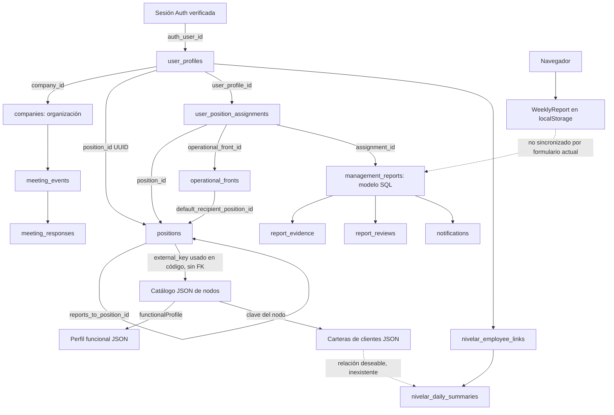
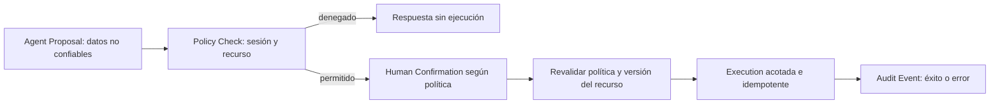

# Fase 2 — Modelo contextual agéntico de Conecta

**Fecha:** 16 de septiembre de 2026. **Base revisada:** commit `2c73cb2` y archivos actuales del repositorio. **Estado:** propuesta arquitectónica; auditoría local terminada, contraste de Supabase desplegado pendiente de acceso.

## Resumen ejecutivo

Conecta tiene una cadena de identidad implementada: sesión Auth → perfil activo → empresa → cargo UUID. También tiene un modelo SQL de asignaciones a cargos y frentes. Sin embargo, el mapa usa otro catálogo, los informes visibles se conservan en `localStorage` y las métricas del piloto Nivelar son constantes de demostración. No existe todavía una fuente única que describa todo el trabajo real del usuario.

Recomendamos que **Supabase sea la autoridad de identidad, pertenencia, cargo y asignaciones**, con `positions.id` como identificador estable. El contenido funcional del catálogo debe pasar por una reconciliación y publicación controladas antes de convertirse en contexto vigente. El catálogo JSON no debe reemplazar silenciosamente un cargo que no se pudo resolver.

La condición para avanzar es una política de acceso comprobable por recurso. Las políticas SQL locales permiten lecturas por empresa y algunas escrituras más amplias que las etiquetas de la interfaz. Agregar políticas de lectura propia no elimina las políticas anteriores. No se certifica aquí una vulnerabilidad explotable en producción: faltan las políticas efectivas, los privilegios y las pruebas con sesiones autorizadas.

El futuro resolver será de backend, con proyecciones pequeñas y específicas por solicitud. El LLM no recibirá credenciales, documentos de identidad, permisos utilizables como credenciales ni toda la organización. **El modelo puede razonar sobre permisos, pero jamás concederse permisos.**

Esta fase no conecta LLM, RAG, memoria ni herramientas; no modifica esquema, RLS o datos remotos. En la continuación del 16 de septiembre se realiza, por solicitud independiente del usuario, un ajuste de presentación de tareas en las fichas y su impresión.

## 0. Método, evidencia y límites

### Fuentes primarias locales

| Ref. | Fuente | Evidencia utilizada |
| --- | --- | --- |
| E01 | [schema.sql](../supabase/schema.sql) | Tablas, FK, restricciones, helpers de sesión y políticas base |
| E02 | [Asignaciones](../supabase/migrations/20260812_operational_assignments.sql) y [lectura por responsable](../supabase/migrations/20260813_responsible_assignment_read_policies.sql) | Evolución local del alcance por asignación |
| E03 | [Nivelar](../supabase/migrations/20260902_nivelar_integration.sql) y [cierre de actualización propia](../supabase/migrations/20260909_restrict_profile_self_update.sql) | Desempeño y cambio de política de perfiles |
| E04 | [Convocatorias SQL](../supabase/20260826_meeting_events.sql) | Eventos y respuestas, fuera del directorio de migraciones |
| E05 | [Tipos](../src/lib/supabase/database.types.ts) | Contrato TypeScript local: 12 tablas; relaciones vacías; funciones omitidas |
| E06 | [Página del agente](../src/app/mapa-vivo/mi-agente/page.tsx), [contratos](../src/lib/conecta/agent.ts), [cliente SSR](../src/lib/supabase/server.ts) | Resolución actual con `auth.getUser()` y proyección por cargo/empresa |
| E07 | [Mapa servidor](../src/app/mapa-vivo/page.tsx) y [gate cliente](../src/components/MapaVivoAuthGate.tsx) | Conversión UUID → external_key y lectura de asignaciones |
| E08 | [OrgExperience](../src/components/OrgExperience.tsx) | Catálogo importado al cliente, permisos de presentación, informes locales, constantes Nivelar |
| E09 | [Organigrama](../src/data/grupo-ac-org.json), [perfil funcional](../src/data/pymes-functional-profiles.json), [carteras](../src/data/pymes-company-assignments.json) | Datos locales efectivamente consumidos |
| E10 | [Permisos](../src/lib/conecta/access-policy.ts), [informes](../src/lib/conecta/reports.ts), [notificaciones](../src/lib/conecta/notifications.ts) | Catálogo de permisos y helpers de acceso a tablas |
| E11 | [API convocatorias](../src/app/api/meeting-events/route.ts), [API por token](../src/app/api/meeting-events/%5Btoken%5D/route.ts), [API Rocket.Chat](../src/app/api/rocket-chat/route.ts) | Autorizaciones reales de rutas y acceso administrativo |
| E12 | [Importador](../scripts/import_pymes_profiles.py), [registro PYMES](pymes-macroproceso-implementacion.md), [arquitectura previa](arquitectura-backend-conecta.md), [accesos](acceso-usuarios-pymes.md) | Historia y límites declarados; documentos históricos no sustituyen evidencia actual |

### Comprobaciones y limitación remota

- Se inspeccionaron código, SQL, tipos y catálogos, sin ejecutar seeds ni migraciones.
- Configuración pública local y documentación identifican el proyecto **`dttljewnvuwhizldnhld`**. No se publicaron claves ni valores personales en esta auditoría.
- La conexión MCP disponible lista otros tres proyectos; Conecta no está entre ellos. Una consulta de lectura a su identificador devolvió `You do not have permission to perform this action`. No se consultaron proyectos ajenos ni se intentó eludir esa restricción.
- Reintento del 16 de septiembre, tras confirmación del usuario de que habilitó acceso: la consulta volvió a devolver el mismo error y el listado continuó mostrando únicamente los proyectos de Wolves. El permiso todavía no está disponible para esta conexión.
- Por tanto **no se inspeccionaron `pg_policies`, datos actuales, migraciones aplicadas, grants, buckets ni funciones desplegadas**. Tampoco se ejecutaron pruebas con cuentas reales. Los recuentos siguientes son de archivos, no de producción.
- El SQL local describe 14 tablas si se incluyen convocatorias y Nivelar; los tipos locales incluyen 12, sin las dos de convocatorias. No se encontró evidencia de que ese archivo tipado sea una generación fiel y reciente: `Relationships: []` y `Functions: Record<string, never>` omiten FK y helpers existentes en SQL.
- El catálogo contiene 54 nodos con IDs distintos. Incluye campos de documento y teléfono, algunos posiblemente marcadores; su presencia no acredita datos personales válidos ni autorización para distribuirlos.
- Carteras: Anderson 2, Jhonatan 10, José Fernando 11 y Yuranny 10: 33 entradas locales. `daysPeriod` dice `Por confirmar`. No son 33 filas acreditadas en `companies`.

**Etiquetas:** REAL = relación implementada en código/SQL local, no necesariamente desplegada; INFERIDA = interpretación que requiere confirmar; PROPUESTA = relación inexistente que se recomienda evaluar. “Sin escritura cliente” significa que no se encontró una política local que la autorice; un administrador de base o `service_role` puede operar por fuera de RLS.

## 1. Mapa del dominio actual

En lectura SQL, “empresa” significa `current_company_id()` obtenido del perfil activo. No equivale a “todos los clientes de PYMES”. Las tablas siguientes resumen políticas locales; los privilegios desplegados siguen pendientes (§9).

| Entidad / fuente / identificador | Relaciones implementadas | Quién puede leer / modificar según evidencia local | Uso actual → posible uso agéntico |
| --- | --- | --- | --- |
| Identidad Auth / Supabase Auth / `auth.users.id` | Perfil por `auth_user_id UNIQUE`, nullable | Sesión propia mediante Auth; administración fuera del flujo normal | Inicio de sesión → sujeto autenticado; token solo backend |
| Perfil / `user_profiles` / UUID | Empresa FK; cargo FK nullable; Auth FK nullable | Lectura por empresa y política de perfil propio activo; sin UPDATE propio tras E03; administración privilegiada | Nombre, habilitación y rol de acceso → identidad laboral y control, no todos sus datos personales |
| Organización / `companies` / UUID y slug único | Perfiles, cargos, frentes, informes, notificaciones, Nivelar y eventos | SELECT de empresa del perfil; sin política cliente de escritura | Tenant de acceso → ámbito organizacional; confirmar `status=active` |
| Cargo persistido / `positions` / UUID, `(company_id, external_key)` único | Empresa; padre por `reports_to_position_id`; perfiles y asignaciones apuntan al UUID | Empresa completa o cargo asignado por E02; sin escritura cliente de catálogo | Agente consulta su cargo; mapa traduce UUID → clave → JSON; futura autoridad del cargo |
| Nodo de catálogo / JSON / `nodes[].id` | `reportsTo` por string; `functionalProfile` a otra clave local | Importado completo por componente cliente; edición mediante repositorio/deploy, no RLS | Mapa, ficha, búsqueda, impresión → contenido candidato tras validación y publicación |
| Unidad / `area`, `business_unit`, `businessUnit`, `level` | Atributos de cargo/nodo, no FK a unidad | Hereda distribución del cargo/catálogo | Agrupación visual → contexto descriptivo; no ACL por unidad todavía |
| Responsable / `responsible_name` o `responsibleName` | Texto del cargo; no FK a persona | Hereda cargo/catálogo | Foto/ficha → etiqueta; no prueba de quién inició sesión |
| Frente / `operational_fronts` / UUID, clave por empresa | Empresa; destinatario predeterminado por cargo | Empresa o frente asignado; sin escritura cliente declarada | Opciones de informes → ámbito de trabajo explícito, no “proyecto” inventado |
| Asignación / `user_position_assignments` / UUID | Perfil, cargo, frente opcional y empresa; tipo, fechas, estado | SELECT empresa o propias; ALL por superadmin/dirección/cultura de la empresa | Frentes del responsable → trabajo asignado con vigencia validada |
| Responsabilidades y actividades / arrays y JSON de `positions`; catálogos locales | Pertenecen al cargo; contenido anidado, no tareas independientes en DB | Hereda cargo/catálogo | Descripción funcional → instrucciones de dominio, nunca ejecución acreditada |
| Macroproceso PYMES / JSON / clave de perfil + códigos de módulo/responsabilidad/subactividad | Nodos referencian `gerente-pymes` o `macroproceso-contable`; tareas son strings | Edición de repositorio; distribuido con interfaz | Desplegables y exportación → referencia de procedimiento validada y versionada |
| Autoridad y límites / `authority` array | Texto del cargo | Hereda cargo/catálogo | Ficha → conocimiento sobre el rol; NO permisos ejecutables |
| Procesos/documentos / arrays `processes`, `documents` | Referencias textuales de cargo; no entidad documental ni ACL | Hereda cargo/catálogo | Listas de referencia → títulos candidatos; no habilitan acceso al contenido referido |
| Empresas a cargo / JSON / clave de nodo y `companies[].id` local | Asociación a nodo por clave; `sourceNumber`, `referenceDays`, procedencia | Repositorio y bundle cliente; sin RLS individual | Card de cartera → planificación referencial, pendiente relación persistida usuario-cliente |
| Informe DB / `management_reports` / UUID | Empresa, cargo, frente, asignación, autor y destinatario | SELECT e INSERT por empresa; UPDATE por superadmin/dirección/gerencia/cultura | Helper DB existe sin consumidor encontrado en formulario actual → futuro trabajo persistido, previa validación de acceso |
| Informe de mapa / `WeeklyReport` / string cargo-tiempo | `roleId`, IDs opcionales de frente/asignación; no FK | `localStorage` del navegador, editable localmente; botones según permisos UI | Formulario, revisión y dashboard locales → no admitir como informe oficial del resolver |
| Evidencia / `report_evidence` / UUID | Informe FK; autor FK; URL textual | SELECT e INSERT por informe de empresa | Modelo SQL; formulario local solo guarda nombre/tamaño y URL → no hay archivo verificado ni ACL de objeto |
| Revisión / `report_reviews` / UUID | Informe y revisor FK | SELECT por informe de empresa; INSERT por rol revisor sin comprobar empresa del informe | Modelo de revisión; mapa revisa estado local → futuro resultado validado, requiere política más precisa |
| Notificación / `notifications` / UUID | Empresa, destinatario, cargo e informe opcionales | SELECT propia o dirección/superadmin de empresa; INSERT por empresa | Helpers disponibles; no integración al formulario encontrada → futuras señales autorizadas, no auditoría inmutable |
| Enlace Nivelar / `nivelar_employee_links` / UUID; cédula única por empresa | Empresa, perfil/cargo opcionales | SELECT empresa; ALL superadmin/dirección/cultura | Esquema de vinculación → resolver técnico privado; no enviar cédula/email al LLM |
| Resumen Nivelar / `nivelar_daily_summaries` / UUID; empresa-cédula-fecha | Enlace, perfil/cargo opcionales; no cliente/tarea | SELECT propia o superadmin/dirección/cultura en empresa; sin escritura cliente | Adaptador de lectura existe; UI usa constantes → métricas futuras solo tras conexión y calidad acreditadas |
| Sincronización Nivelar / `nivelar_sync_runs` / UUID | Empresa y solicitante opcionales | SELECT liderazgo anterior; sin escritura cliente | Modelo de bitácora técnica → frescura/calidad, errores completos solo backend |
| Convocatoria / `meeting_events` / UUID | Empresa y creador; token hash único | RLS lectura empresa, escritura líderes; API interna exige líderes incluso para GET | Gestión persistida por ruta API → compromisos solo si existe relación autorizada; `audience_label` no demuestra membresía |
| Respuesta / `meeting_responses` / UUID | Evento FK; nombre/rol declarados sin FK al perfil | Empresa vía evento; líderes gestionan; API pública por token usa admin | RSVP → respuesta a evento; no prueba de identidad laboral ni asignación del usuario |
| Rol de acceso / enum + `accessRolePermissions` + `accessProfiles` UI | `user_profiles.access_role`; helpers SQL tienen reglas separadas | Código de aplicación / SQL; perfil administrado | Permisos descriptivos, UI y RLS no idénticos → base para diseñar política explícita por acción/recurso |

### Relaciones que NO deben suponerse

- REAL: `profile.position_id → positions.id`; REAL: traducción `external_key → nodes.id` en presentación. No hay FK entre DB y archivo JSON.
- REAL: jefe por cargo en SQL y padre por nodo en JSON. INFERIDA: que ambos árboles son iguales hoy.
- REAL: asignación a frente. INEXISTENTE: proyecto, tarea ejecutable, instancia de tarea por cliente y período o asignación de cada subactividad a un usuario.
- REAL: cartera JSON por nodo. INEXISTENTE: FK de esos clientes a `companies`, a perfiles o a resúmenes Nivelar.
- REAL: nombres de documentos/procesos. INEXISTENTE: catálogo de fuentes con archivo, versión aprobada y ACL.
- REAL: `default_recipient_position_id`; INFERIDA: persona destinataria única. Un cargo podría tener varios perfiles; debe resolverse sin elegir uno arbitrariamente.
- REAL: jerarquía local de Diana hacia Yuranny y Estiven hacia gerente. INEXISTENTE: regla que convierta esa jerarquía por sí sola en autorización de aprobar, leer datos sensibles o ver la cartera completa.

## 2. Diagrama de relaciones



Las flechas continuas describen enlaces implementados, con la salvedad explícita de la correspondencia por string. Las punteadas muestran brechas; no describen integración funcionando.

## 3. Doble representación del cargo

### Estado actual y origen

El documento histórico E12 presenta el JSON como base del prototipo y deja “migrar el JSON a positions” como siguiente fase. Esto explica documentalmente la coexistencia; no acredita una migración terminada. Los cambios `eac6297` y `2c73cb2` actualizan fichas/carteras locales. E12 declara expresamente que no sincronizaron Supabase. El agente del commit `737a386` consulta exclusivamente la tabla.

| Aspecto | Catálogo JSON | `positions` |
| --- | --- | --- |
| Identidad | ID semántico de nodo | UUID y external_key único dentro de empresa |
| Estructura | `reportsTo`, `level`, `area`, `businessUnit` | FK de jefe, empresa, area/business_unit como texto |
| Descripción | Propósito, listas, fotos, etiquetas de cargo, equipo, riesgos, `functionalProfile` | Propósito, arrays, activities JSON; sin campos propios de `functionalProfile`, fotos o `positionLabel` en tipos locales |
| Persona | Nombre, documento/teléfono, foto | Nombre, documento/teléfono; identidad autenticada está en perfil |
| Consumo | Mapa, ficha, búsqueda, impresión, carteras | Agente, puente de acceso al mapa, asignaciones, FK de informes/Nivelar |
| Autorización | Ninguna autoridad backend; filtros/controles UI | RLS por empresa/asignación; `access_role` procede del perfil, no del título |

En E07 se reemplaza el campo de salida `profile.position_id` por `external_key`, con fallback al UUID si falla la consulta. E08 busca ese valor en `nodes[].id`; si no coincide, selecciona el primer nodo. Así, un error de correspondencia puede mostrar un cargo que no es el del usuario. No implica que se hayan cambiado sus permisos DB, pero es una base insegura para construir contexto.

### Riesgo de divergencia

1. La ficha puede mostrar Analista Integrador y el backend un título anterior; no se afirma que ocurra hoy en producción sin comparar filas.
2. El detalle de tareas/control/resultado del catálogo funcional no llega automáticamente a `positions.activities` ni a la página del agente.
3. Un cambio de `reportsTo` no cambia `reports_to_position_id` ni asignaciones.
4. `external_key` garantiza unicidad **por empresa en DB**, no existencia en JSON, igualdad del contenido, vigencia ni correspondencia entre tenants. El catálogo no contiene una clave tenant por nodo.
5. `responsible_name` no sustituye la identidad del perfil. Renombrar un cargo o una persona no debe reasignar cuentas.

## 4. Fuente autoritativa recomendada y migración propuesta

| Alternativa | Ventaja | Coste / riesgo |
| --- | --- | --- |
| Mantener JSON como autoridad total | Edición versionada simple | No resuelve identidad ni ACL multiempresa; obliga a mantener puente y dos modelos |
| DB para identidad/cargos/asignaciones + publicación versionada de contenido funcional | Reutiliza FK y sesión; permite consistencia y acceso por recurso | Requiere reconciliar datos, definir versión y conservar la riqueza del catálogo |
| Sincronización bidireccional automática | Editar en ambos lados | Conflictos, ciclos y sobrescrituras; sin gobernanza actual |

**Recomendación:** segunda alternativa. Autoridad operativa en DB; JSON como fuente de importación/publicación y, eventualmente, proyección generada para presentación. `positions.id` identifica el cargo; `(company_id, external_key)` es clave de interoperabilidad. Una definición funcional publicada puede compartirse por varios cargos, sin compartir automáticamente permisos. Esta entidad versionada es una propuesta, no una tabla existente.

No decidir todavía si se normalizan responsabilidades/tareas en tablas o se publica una estructura JSON versionada: el primer hito debe evaluar consultas, reutilización y aprobación. Evitar cargar textos completos duplicados por cada funcionario.

**Plan de migración, sujeto a aprobación:**

1. Obtener inventario desplegado y exportación mínima sin datos personales innecesarios. Comparar UUID, tenant, clave, título, padre y hashes del contenido.
2. Clasificar correspondencias exactas, ausentes, duplicadas y ambiguas. Resolver discrepancias con dueño del dominio; jamás emparejar por similitud de nombre como autoridad.
3. Separar identificadores tipados: `positionUuid`, `catalogKey`, `clientReferenceId`; retirar el campo de significado dual.
4. Aprobar publicación y versión del contenido funcional; preservar fotos/etiquetas donde corresponde, no convertirlas en privilegios.
5. Diseñar constraints de coherencia entre empresa, cargo, perfil y asignación; decidir explícitamente si existe trabajo entre empresas.
6. Proponer migración idempotente con validaciones, respaldo y reversión; revisar antes de ejecutarla. No reasignar perfiles por un renombre.
7. Comparar proyecciones en lectura paralela sin cambiar autorizaciones; registrar divergencias sin duplicar escrituras.
8. Cambiar consumidores gradualmente a la proyección autorizada, eliminar fallback al primer nodo y dejar el JSON como artefacto derivado o fuente editorial controlada.
9. Regenerar tipos desde el esquema efectivo y probar casos de cargo vacante, varios ocupantes, ausencia de cargo y asignación temporal.

## 5. Arquitectura del contexto agéntico

Dos salidas distintas: **contexto interno de resolución/política** y **proyección mínima para interfaz o futura solicitud al modelo**. No serializar el objeto interno completo. El DTO actual `AgentContext` sirve a la pantalla, no es contrato aprobado para un LLM.

En las tablas: B = backend; UI = interfaz del usuario autorizado; M = modelo futuro solo cuando la finalidad lo exige y se apruebe el tratamiento. Hoy no se envía nada al modelo. Sensibilidad “interna” tampoco significa pública.

### AgentIdentity

| Campo conceptual | Origen / motivo | Sensibilidad y destino | Validación |
| --- | --- | --- | --- |
| `subjectId` | `auth.getUser().user.id`; sujeto de política | Identificador interno; B | Sesión verificada, nunca body/query |
| `profileId` | Perfil por sujeto; vínculos de trabajo | Interna; B; referencia opaca UI si necesaria | Perfil único y activo |
| `companyId` | Perfil → companies; tenant | Interna; B | Existencia, lectura autorizada, empresa activa |
| `displayName` | `full_name`; saludo | Personal; UI; M normalmente omitido o nombre mínimo | Perfil propio; no usar `responsible_name` como identidad |
| `accessRole` | Perfil; evaluación determinística | Interna; B, etiqueta UI opcional; no M por defecto | Enum reconocido; releer en operaciones sensibles |
| `resolvedAt` | Reloj servidor; frescura | Técnica; B/UI | Generado por backend, no fecha del navegador |

### AgentRoleContext

| Campo conceptual | Origen / motivo | Sensibilidad y destino | Validación |
| --- | --- | --- | --- |
| `positionId`, `catalogKey` | UUID y external_key; trazabilidad | Interna; B; no M salvo referencia opaca | Cargo del perfil, empresa consistente; clave no concede acceso |
| `title`, `purpose` | positions; entender función | Interna; UI/M mínimo | SELECT autorizado, estado admitido definido por política |
| `area`, `businessUnit` | Atributos cargo; contexto | Interna; UI/M si relevante | Valores de DB; no convertir string en ACL |
| `responsibilities` | positions; función esperada | Interna; UI/M filtrado por tarea | Proyección acotada y origen visible |
| `activityReference` | activities; futuro contenido publicado | Interna; UI/M fragmentos | Validar forma JSON; versión/semántica antes de mezclar catálogo |
| `managerPositionId` | reports_to_position_id; dependencia | Interna; B; UI/M etiqueta mínima si autorizada | Mismo ámbito permitido, detectar ciclos; no cargar todo el árbol |
| `authorityText` | authority; límites descriptivos | Interna; UI/M solo como texto citado | Marcar explícitamente “no concede permisos” |
| `sourceVersion` | Hoy hash de fuente/lectura; versión publicada futura | Técnica; B/UI/cita M | No fingir versión oficial a partir de `updated_at` sin mecanismo de actualización probado |

### AgentWorkContext

| Campo conceptual | Origen / motivo | Sensibilidad y destino | Validación |
| --- | --- | --- | --- |
| `assignments[].id/positionId/frontId/kind` | user_position_assignments; trabajo explícito | Interna; B; UI/M etiquetas necesarias | Perfil propio, status y fechas, coherencia de tenant y referencias |
| `assignments[].label/reportFrequency` | Asignación; obligación periódica | Interna; UI/M si pregunta lo requiere | Misma autorización que asignación; no implica informe creado |
| `reports[].id/status/period/deadline` | management_reports; seguimiento | Laboral/confidencial; B/UI/M mínimo | Política explícita por autor/destinatario/equipo + RLS; no habilitar con lectura amplia únicamente |
| `reportExcerpt` | Campos de avance/pendientes | Potencialmente sensible; M solo fragmento necesario | Revalidar informe y redactar datos de terceros; nada desde localStorage como autoridad |
| `clientReferences` | Cartera JSON; planificación provisional | Comercial; no M en primera etapa | No habilitada hasta aprobar vinculación tenant-cargo-cliente y ACL; no inferir por nombre |
| `performanceSummary` | Nivelar persistido | Datos laborales sensibles; excluido por defecto | Política específica, usuario/alcance, fecha y calidad; nunca constantes del piloto |
| `availability` | Resultado por cada fuente | Técnica; B/UI | Diferenciar no configurado, vacío autorizado, no autorizado y fallo |

### AgentKnowledgeContext

| Campo conceptual | Origen / motivo | Sensibilidad y destino | Validación |
| --- | --- | --- | --- |
| `referenceLabels` | processes/documents; orientación | Interna; UI/M como referencias sin contenido | Cargo autorizado; no prometer documento consultable |
| `authorizedSources` | No existe catálogo ACL hoy | Futuro; B | Estado inicial `not_configured`, no simular fuentes |
| `excerpt/citation/version` | Futura recuperación autorizada | Según fuente; UI/M | ACL antes de buscar/recuperar y otra vez antes de entregar; procedencia comprobada |

### AgentCapabilityContext

| Campo conceptual | Origen / motivo | Sensibilidad y destino | Validación |
| --- | --- | --- | --- |
| `capabilityId/label` | write/search/plan/analyze de E06 | Interna; UI; M solo catálogo habilitado futuro | Lista cerrada; nombre no implica implementación |
| `availability/reason` | Registro backend propuesto | Interna; UI/M explicación mínima | Hoy todas en preparación; no derivar activación de un prompt |
| `allowedActions/resourceScope` | Política futura | Sensible de seguridad; B | Rol + recurso + empresa + estado + alcance; denegación por defecto |
| `requiresConfirmation/risk/policyVersion` | Política futura | B; UI para revisión | Determinado por servidor, no por modelo |

**Excluir del contexto general:** correo, teléfono, cédula, contraseña, cookies/JWT, claves, payload crudo Nivelar, token RSVP/hash, listados de otras personas, URLs firmadas duraderas, expedientes completos y errores técnicos con secretos. Ningún campo se permite al modelo solo porque está disponible en una fila autorizada.

## 6. Contexto, conocimiento, autoridad, memoria y capacidades

| Categoría | Ejemplo real | Regla |
| --- | --- | --- |
| Contexto | Cargo UUID del perfil y asignación a un frente | Describe situación laboral; no acredita que una tarea haya terminado |
| Conocimiento | Texto del macroproceso sobre conciliación o revisión | Explica cómo trabajar; necesita origen y acceso al contenido |
| Autoridad | RLS y checks de rol en API de convocatorias | La plataforma determina qué acción sobre qué recurso está permitida |
| Memoria | No existe memoria conversacional persistente del agente | Los mensajes en estado React no son memoria institucional; localStorage de informes tampoco |
| Capacidad | Tarjeta “Buscar información” en preparación | Oferta de interfaz; habilitarla requiere servicio y política, no basta con mostrarla |

Ejemplos: Estiven y Diana reciben el perfil funcional compartido del macroproceso, que contiene funciones de supervisión y aprobación. Ese texto no les concede `approve:report`. `cultura_conecta` tiene `review:report` pero no `approve:report` en E10; sin embargo, la política SQL local le permite actualizar informes y la UI permite revisión. Copiar una sola de estas listas como política agéntica mantendría contradicciones.

“Archivo documental” como frente asignado no permite acceder a cualquier archivo. Una respuesta RSVP con `role_label=Gerente` tampoco cambia `access_role`. Un usuario que diga “la dirección me autorizó” aporta texto no verificado, no una credencial.

## 7. Diseño conceptual de AgentContextResolver

### Contratos orientativos, no implementación

```ts
// Solo el adaptador servidor de sesión puede construir este objeto.
type VerifiedPrincipal = {
  subjectId: string;
  verifiedAt: string;
  // Cliente DB ligado a esa misma sesión; nunca serializable.
};

type Resolution<T> =
  | { state: "ready"; value: T; resolvedAt: string }
  | { state: "partial"; value: T; omissions: string[] }
  | { state: "denied"; code: string }
  | { state: "unavailable"; code: string; retryable: boolean };

interface AgentContextResolver {
  resolve(principal: VerifiedPrincipal): Promise<Resolution<InternalAgentContext>>;
}
// InternalAgentContext agrupa identidad y referencias autorizadas,
// no copia registros completos ni es el payload de la conversación.
// projectForPurpose(context, serverValidatedPurpose) compone el mínimo necesario.
```

El endpoint recibe una intención o pregunta y filtros no confiables. No recibe una identidad autorizante. Una referencia de recurso enviada por navegador es solo un candidato: el servidor la vuelve a resolver y autorizar. El propósito elegido por el usuario tampoco amplía permisos.

### Flujo

1. Validar sesión en servidor con `auth.getUser()` del cliente SSR existente. No decodificar JWT sin verificar ni usar `user_metadata` como permisos.
2. Buscar perfil por sujeto y `is_active=true`; exigir resultado único. No buscar por nombre/correo del prompt.
3. Resolver empresa del perfil y comprobar estado. Si falta o está inactiva, denegar contexto institucional.
4. Resolver cargo por UUID y ámbito. No fallback al JSON ni primer nodo; `position_id=null` es un estado explícito.
5. Resolver estructura mínima: cargo propio y, si está autorizado, jefe inmediato. Detectar bucles y limitar profundidad; no expandir compañeros por compartir área textual.
6. Consultar asignaciones propias con estado y vigencia: `starts_at <= fechaServidor` y `ends_at IS NULL OR ends_at >= fechaServidor`. Definir zona de negocio antes de implementar. Validar cargo/frente y empresa; poner en cuarentena relaciones inconsistentes, no ampliarlas.
7. Componer referencias de trabajo persistido solo si política específica y RLS lo permiten. Ausencia de fuente oficial no se completa desde datos del navegador.
8. Resolver catálogo de capacidades desde backend. Hoy: `not_configured`; no habilitar ejecutores.
9. Proyectar salida para UI. En fase futura, otra proyección por propósito para modelo con límites de elementos/tamaño y fuentes. El cliente no recibe `InternalAgentContext` completo.
10. Registrar diagnóstico mínimo, identificador de solicitud y origen; evitar guardar contenido sensible por defecto. Revalidar para cada acción, no confiar en el contexto que volvió desde el cliente.

**Sesión consistente:** si una ruta acepta bearer, el cliente que consulta DB debe utilizar esa misma identidad. E11 verifica bearer opcional con `getUser(token)` sobre un cliente SSR de cookies; no se observa en esa ruta sustitución del token de las consultas. El diseño debe evitar mezclar identidad validada por bearer con sesión DB de otra cookie. Se requiere prueba específica, sin afirmar explotación actual.

### Estados y errores

| Situación | Resultado |
| --- | --- |
| Sin sesión / inválida | 401, sin contexto |
| Perfil inexistente/inactivo; empresa ausente/inactiva | 403; diagnóstico privado; no revelar existencia de terceros |
| Cargo nulo | Contexto parcial de identidad, `position_unassigned`; capacidades dependientes deshabilitadas |
| Cargo referenciado invisible o incongruente | `position_unresolved`; no adivinar si falta o está prohibido en respuesta pública |
| Mapeo JSON ausente/divergente | `catalog_unreconciled`; no combinar fuentes como si fueran equivalentes |
| Cero asignaciones autorizadas | Colección vacía con `ready`, sin inventar tareas |
| Consulta falla | `unavailable`; no convertir error en “no tienes trabajo” como sucede en loaders actuales |
| Varias asignaciones primarias | Error de integridad para selección principal; no elegir la primera por fecha |
| RAG/Nivelar/capacidad no conectada | `not_configured`, no `ready` con datos de demostración |
| Cargo sin actividades estructuradas | Referencias disponibles; detalle no disponible, sin reconstrucción automática |

Sin caché compartida global de contexto. Una caché futura debe incluir sujeto, empresa, versión de política y fuente, tener vencimiento corto y mecanismo de revocación. Los cambios de rol/asignación deben revalidarse antes de usar datos o ejecutar acciones.

## 8. Fronteras de confianza

| Frontera | Puede cruzar | No debe cruzar | Revalidación y responsabilidad |
| --- | --- | --- | --- |
| Browser → Server | Sesión por canal previsto, pregunta, candidatos de recurso, parámetros limitados | Permisos autoritativos, usuario/empresa/cargo elegidos como autoridad | Verificar sesión, esquema, identidad y ámbito; localStorage no es fuente oficial |
| Server → Browser | DTO propio y referencias autorizadas | Credenciales admin, contexto de terceros, catálogos completos con datos sensibles | Proyección antes de serializar; ocultar un campo visualmente no lo protege |
| Server → Database | Consultas parametrizadas bajo sesión; filtros mínimos | Consultas/SQL redactado por LLM ejecutado directamente | RLS + política del servidor; reservar cliente admin a flujos específicos |
| Database → Server | Filas/columnas necesarias, procedencia | Asumir que texto almacenado es instrucción confiable | Integridad, tenant, estado y sensibilidad de campos |
| Server → LLM | Fragmentos necesarios, etiquetas y referencias opacas | Tokens, secretos, cédula, payload crudo, autorización delegada | Política de salida y finalidad aprobadas; contenido como datos |
| LLM → Server | Respuesta o propuesta estructurada | Concesiones de permisos, decisiones de ACL, SQL ejecutable como mandato | Validar esquema, recursos y capacidad mediante política determinística |
| Retrieval → Server → LLM | Resultados ya autorizados y con citas | Corpus completo para que el modelo lo filtre | ACL previa a recuperación, comprobación antes de entrega y revocación |
| Server → Future tools | Comando validado y acotado al recurso autorizado | Prompt libre como permiso, credenciales generales del usuario | Revalidación inmediatamente antes de ejecutar; confirmación cuando política exija |

Los documentos, comentarios y resultados externos pueden contener instrucciones maliciosas. Se tratan como contenido citado y no modifican la política del sistema. Ninguna respuesta del LLM determina pertenencia, visibilidad, aprobación o identidad.

## 9. Auditoría RLS local y verificación pendiente

### Evolución y políticas coexistentes

E01 habilita RLS en nueve tablas. E02 agrega frentes/asignaciones (también incluidos en el esquema base) y políticas propias. La migración del 13 de agosto **solo reemplaza las políticas con sus mismos nombres**, no elimina `read positions by company`, `read profiles by company`, `read assignments by company` ni `read operational fronts by company`.

Las políticas permisivas se combinan como alternativas: una política adicional más acotada no restringe otra más amplia. En este caso `responsibles read assigned positions` y la de frentes incluyen además la condición de empresa como alternativa. Por tanto, la lectura propia no acredita aislamiento por cargo. Véase [RLS de Supabase](https://supabase.com/docs/guides/database/postgres/row-level-security).

E03 elimina `users update own profile`; el esquema local ya no la declara. E12 indica que fue retirada remotamente en una revisión anterior, pero eso no sustituye confirmar su ausencia hoy. E04 reemplaza las cinco políticas de convocatorias por nombre. No hay evidencia actual de qué secuencia exacta se aplicó al proyecto.

### Matriz de políticas locales

| Recurso | SELECT | Escrituras |
| --- | --- | --- |
| companies | Propia empresa | Ninguna política cliente |
| positions | Empresa OR asignación propia activa | Ninguna política cliente |
| user_profiles | Empresa OR perfil propio activo | UPDATE propio retirado; administración privilegiada |
| operational_fronts | Empresa OR asignación propia activa | Ninguna política cliente |
| user_position_assignments | Empresa OR perfil propio; ALL también permite leer a roles gestores | ALL superadmin/dirección/cultura con empresa coincidente |
| management_reports | Empresa | INSERT solo empresa; UPDATE roles revisores, WITH CHECK solo empresa; sin DELETE |
| report_evidence | Informe de empresa visible por subconsulta | INSERT mismo criterio, sin vínculo obligatorio entre uploader y sesión |
| report_reviews | Informe de empresa | INSERT solo rol revisor; no tenant, propiedad del informe o identidad de revisor explícitos |
| notifications | Empresa y destinatario propio o dirección/superadmin | INSERT solo empresa; sin UPDATE para marcar leída |
| nivelar_employee_links | Empresa | ALL superadmin/dirección/cultura |
| nivelar_daily_summaries | Empresa y perfil propio o superadmin/dirección/cultura | Ninguna política cliente |
| nivelar_sync_runs | Empresa y superadmin/dirección/cultura | Ninguna política cliente |
| meeting_events | Empresa, rol DB authenticated | INSERT/UPDATE líderes; check de empresa y rol |
| meeting_responses | Evento de empresa, authenticated | ALL líderes de empresa del evento; API por token escribe con admin fuera de estas políticas |

### Hallazgos priorizados

La severidad expresa impacto potencial y prioridad; el tipo expresa el nivel de prueba. **No hay vulnerabilidad de producción comprobada en esta ejecución.** Sí hay defectos y rutas amplias demostrables en los archivos.

| ID / severidad / tipo | Evidencia y riesgo | Qué confirmar / propuesta |
| --- | --- | --- |
| R01 — ALTO — riesgo arquitectónico | E01 `insert reviews by reviewer roles` (línea 320): solo verifica rol. Permite conceptualmente insertar revisión referenciando informe/revisor ajenos si se conocen UUID válidos; FK no comprueba autorización | Grants y política efectiva; ensayo controlado entre tenants. Proponer check de informe autorizado y revisor=session |
| R02 — ALTO — riesgo arquitectónico | E01 INSERT informes (275) valida solo company_id; autor, cargo, asignación y destinatario no ligados a sesión; también acepta lector a nivel de predicado | Confirmar privilegios; pruebas lector/responsable y referencias cruzadas. Nueva política por acción y coherencia |
| R03 — ALTO — riesgo arquitectónico | Lecturas por empresa de cargos, perfiles, informes y enlaces Nivelar, coexistiendo con lecturas propias | Confirmar alcance deseado; no equiparar “view:own-position” UI con aislamiento. Proyecciones de columnas y RLS coherentes |
| R04 — ALTO — riesgo arquitectónico comprobado en cliente | E08 importa JSON completo con campos sensibles; filtros visuales no son control de entrega. Además, localStorage usa una clave común sin ámbito por usuario/empresa | Separar catálogo público de información privada y servir proyección. Validar exposición del bundle y cambio de usuario en mismo navegador; no ejecutar prueba invasiva aquí |
| R05 — ALTO — riesgo arquitectónico | E11 Rocket.Chat permite usuario autenticado sin perfil/rol/empresa; recibe actor/destino del payload. Excepción local acepta bearer no validado si hostname parece local | Revisar alcance, validación de destinos y proxy/Host; no se enviaron mensajes ni se demostró bypass externo |
| R06 — ALTO — riesgo arquitectónico | FK simples no fuerzan igualdad de company_id entre perfiles, cargos, asignaciones, informes y referencias. Asignación gestora podría enlazar recursos de otro tenant | Inspeccionar constraints/triggers efectivos; aprobar transversales entre empresas o prohibirlas explícitamente |
| R07 — MEDIO — riesgo arquitectónico | Fechas de asignación no se evalúan en loaders ni políticas adicionales; propia asignación se lee sin status; uniqueness con frente NULL permite duplicados; no unique de primary | Confirmar datos y múltiples primarias; diseñar vigencia y constraints antes del resolver |
| R08 — MEDIO — riesgo arquitectónico | Permisos E10, `accessProfiles` UI y SQL divergen: cultura crea pulso/ve sensibles en UI, no en E10; SQL puede actualizar estado de informes | Definir matriz única por acción/recurso, sin copiar ninguna representación ciegamente |
| R09 — MEDIO — riesgo arquitectónico | Tipos omiten meetings, FK y helpers; E11 usa `as any`; schema base y migración de asignaciones repiten CREATE POLICY | Comparar historial real; no ejecutar todos los SQL concatenados; regenerar tipos después de reconciliar |
| R10 — MEDIO — configuración por verificar | Helpers SECURITY DEFINER con search_path fijado y filtro auth.uid/activo; grants de EXECUTE y owner no están en archivos | Inspeccionar definiciones y permisos. No declarar vulnerabilidad solo por SECURITY DEFINER |
| R11 — MEDIO — riesgo arquitectónico | No comprobación de companies.status en helpers ni en página actual; roles y perfil activo no prueban empresa activa | Acordar semántica de suspensión; denegar futura resolución para empresa inactiva |
| R12 — MEDIO — riesgo arquitectónico | Verificación bearer y cliente de DB por cookies en ruta interna de meetings (§7) | Probar identidad única por solicitud; no afirmar privilegios cruzados sin reproducción |
| R13 — MEDIO — configuración por verificar | Política propia de UPDATE eliminada localmente; no inventario remoto actual; storage/grants/views desconocidos | Verificar ausencia efectiva y no dar por cerrada auditoría remota |
| R14 — BAJO — integridad/operación | notifications no tiene UPDATE cliente aunque existe read_at; updated_at no tiene trigger visible; errores de carga se convierten en arrays vacíos | Confirmar flujos, frescura y estados explícitos; no fabricar capacidades |

**Crítico:** ningún hallazgo clasificado crítico con la evidencia disponible. Una prueba futura de escalamiento efectivo de rol o fuga transversal puede cambiar la severidad; no se presupone.

Los summaries Nivelar excluyen a gerencia salvo sus propios registros, mientras textos del producto hablan de consolidación gerencial. No ampliar acceso por esa intención: es una decisión pendiente. Evidencias/notificaciones permiten referencias por FK sin comprobar todas las identidades; deben entrar en pruebas de escritura. La lectura de subtablas por `EXISTS` tampoco debe evaluarse sin considerar RLS de la tabla padre.

### Pruebas requeridas antes de habilitar contexto

Con cuentas de prueba autorizadas, en entorno apropiado: anónimo; perfil inactivo; lector; dos responsables del mismo tenant; gerencia de equipo propio/ajeno; cultura; dirección; otra empresa; asignación vencida/futura/inactiva/transversal; múltiples primarias. Para cada recurso probar SELECT permitido y denegado, proyecciones sensibles, INSERT con autor/revisor falso y referencias cruzadas, UPDATE de campos de autorización, y rutas API directamente sin botones. Las escrituras de prueba deben usar fixtures y transacciones reversibles; aquí no se ejecutaron.

Criterios: ni el rol ni el tenant deben poder modificarse con input cliente; un rol no habilitado no inserta revisiones; el informe no puede enlazar referencias incoherentes; una revocación afecta siguiente consulta; `service_role` no prueba RLS. Registrar resultado esperado, observado, usuario de prueba y versión de política sin contraseñas.

## 10. Requisitos previos para RAG

Hoy no hay entidad documental con ACL, índice, chunks o vínculo de contenidos de archivos al cargo. `processes` y `documents` son arrays de texto; la fuente de importación de DOCX es procedencia editorial, no repositorio documental autorizado. `report_evidence.file_url` no acredita control sobre el recurso externo. No se encontraron políticas de Storage ni carga real de archivos en el flujo inspeccionado.

### Diseño conceptual de fuente

Reutilizar identificadores existentes: `company_id`, `position_id`, `user_profile.id`, `operational_front.id`. No inventar un `unit_id` antes de que exista una unidad formal.

| Grupo propuesto | Campos / criterio |
| --- | --- |
| Identidad | sourceId, companyId, kind, título; referencia a evidencia/informe si esa es la fuente |
| Procedencia | sistema origen, registro origen, dueño editorial, hash, fecha de obtención, URI backend |
| Publicación | versión, estado borrador/publicado/retirado, vigencia, aprobador; aprobación de contenido separada de autorización de acceso |
| Alcance | empresa, usuario específico, cargo/asignación/frente o recurso padre; ninguna ACL por string libre |
| ACL | sujetos/roles permitidos y reglas de recurso; tenant obligatorio salvo excepción explícita; ausencia de política = denegado |
| Sensibilidad | clasificación, campos excluidos, si permite uso con modelo, retención |
| Derivados | fragmentos e índice heredan tenant, versión y ACL de fuente; nunca permisos más amplios |

Una fuente de informe debería heredar su autorización dinámica de informe, no copiar una lista de lectores que quede obsoleta. Una futura ACL por unidad exige entidad y membresía verificables; `business_unit` no basta. La misma etiqueta “direccion” en otra empresa no concede acceso.

Antes de indexar: aprobar alcance y dueño; resolver versión vigente; comprobar permiso de obtener archivo y almacenarlo; retirar PII innecesaria; definir revocación/borrado de derivados; establecer filtros por tenant/recurso y pruebas de aislamiento. Las fuentes sin clasificación quedan fuera.

Flujo futuro: sesión → política → conjunto/filtro autorizado → búsqueda dentro de ese ámbito → revalidación de resultados → fragmentos y citas → modelo. Nunca buscar todo y delegar al modelo qué ocultar. Aplicar los mismos filtros a títulos, snippets, conteos y cachés para evitar filtraciones indirectas. URLs firmadas, si se usan, de vida corta y entregadas únicamente a destinatario autorizado.

## 11. Frontera futura de herramientas



Contrato mínimo futuro: identidad verificada del actor; capability/tool ID y versión; tipo/ID de recurso; acción; empresa y alcance; argumentos validados; riesgo; requires_confirmation; versión de política; idempotency key; resultado; audit event/request ID. Identidad, riesgo, ámbito y requisito de confirmación se calculan en servidor, aunque la propuesta incluya sugerencias.

Reutilizable: sesión SSR, perfil activo, UUID/FK, vocabulario de roles y algunos predicados de empresa. **No reutilizable como garantía suficiente:** permisos UI, `accessRolePermissions` aislado, texto authority, nombres de cargos, token RSVP o acceso admin. Hace falta política por acción/recurso/estado, registro de herramientas habilitadas, confirmación vinculada a argumentos y auditoría durable. Nada de esto se crea en esta fase.

Ejemplos futuros: consultar cargo propio puede ser solo lectura sin confirmación adicional; preparar borrador no implica enviar; enviar un informe requiere validar autor/asignación/destinatario y confirmación según política; aprobar exige autorización específica y control de conflicto de interés; alertar por Rocket.Chat requiere permiso propio para canal y destinatario. La interfaz actual no acredita esas garantías.

La confirmación mostrará efecto, destinatario y datos concretos. Un “sí” debe vincularse a propuesta/version/argumentos vigentes, no a futuras acciones indeterminadas. Si cambian recurso o permisos se invalida. Registrar también denegaciones y fallos, sin guardar secretos ni contenido completo innecesario. Reintentos no deben duplicar informes o mensajes.

## 12. Riesgos de dominio adicionales

- Mezclar empresa organizacional y cliente contable rompería el aislamiento; modelarlos separadamente hasta que se apruebe la relación.
- El catálogo funcional común de contadores y analistas describe trabajo, no separación de funciones ni permisos de aprobación.
- Jerarquía organizativa no equivale automáticamente a equipo autorizado; falta decisión sobre alcance por descendientes y excepciones transversales.
- `responsible_name` y nombre de perfil pueden diferir sin implicar cambio de identidad. El vínculo Auth debe prevalecer.
- La ruta `src/app/api/nivelar/status/route.ts` informa presencia de configuración mediante booleanos; no consulta datos ni demuestra sincronización.
- Constantes de Nivelar y estados locales de informes pueden aparentar trabajo real. El resolver debe rechazarlos como evidencia, y la interfaz debería distinguirlos en fase posterior.
- “Tiempo productivo” no acredita resultado aceptado ni capacidad libre. No existe atribución persistida a cliente/tarea; no inferir eficiencia individual con esos datos.
- `updated_at` y fecha del catálogo no bastan para demostrar contenido aprobado o cambios capturados; falta gobierno de versiones.

## 13. Decisiones que requieren aprobación

| Decisión | Responsable propuesto | Recomendación para revisar |
| --- | --- | --- |
| Fuente autoritativa y publicación funcional | Dirección + dueño de producto | DB para identidad/cargo/asignaciones; catálogo publicado/versionado para contenido |
| Lectura de directorio vs datos personales | Dirección + responsable de datos | Separar campos de directorio de documentos/teléfonos y restringir entrega |
| Alcance de gerencia y cultura | Dirección | Definir matriz por acción/recurso, no por descripción de UI |
| Asignaciones entre empresas | Dirección + arquitectura | Denegar por defecto hasta aprobar casos y constraints |
| Clientes PYMES y relación con tenant | Gerencia PYMES | Entidad de cliente diferenciada; relación explícita a cargo/perfil con vigencia |
| Contadores vs analistas: ejecución y validación | Gerencia PYMES | Precisar tareas compartidas y segregación de aprobaciones |
| Modelo de contenido funcional | Producto + ingeniería | Comparar estructura publicada JSON vs tablas antes de proponer DDL |
| Uso de datos Nivelar por agente | Dirección + responsable de datos | Excluir inicialmente; acordar alcance, calidad y finalidad |
| Fuentes documentales y ACL | Dueño documental + seguridad | Registro de fuentes aprobado y filtrado previo a recuperación |
| Política de herramientas/confirmación/auditoría | Dirección + ingeniería | Propuesta separada antes de cualquier ejecutor |

Estas decisiones no son autorización para aplicar cambios ahora. No se pide aprobar una migración inexistente; la próxima propuesta deberá incluir diff de modelo, impacto, validaciones y reversión.

## 14. Plan incremental y criterios de cierre

1. **Completar evidencia remota:** habilitar acceso al proyecto correcto o entregar exportación administrativa de metadatos. Comparar con archivos; ejecutar matriz de pruebas autorizadas. Salida: inventario efectivo y hallazgos confirmados/descartados.
2. **Resolver identidad del cargo:** reporte de correspondencias y divergencias, sin escritura. Salida: dueño, autoridad y clave de unión aprobados; ningún fallback silencioso.
3. **Aprobar política del dominio:** empresa vs cliente, jerarquía vs autorización, asignaciones vigentes y campos sensibles. Salida: tabla allow/deny por recurso/acción y casos de prueba.
4. **Proponer ajustes de datos/RLS:** solo si necesarios, en documento/diff revisable con migración y reversión futuras. Ejecución posterior a aprobación explícita.
5. **Implementar resolver de solo lectura en otra fase:** contexto propio mínimo, fuentes oficiales y estados explícitos. Verificar aislamiento y revocación; sin LLM como primer hito.
6. **Preparar conocimiento:** catálogo/ACL/procedencia/publicación. Pruebas de búsqueda autorizada antes de conectar generación.
7. **Habilitar una capacidad de lectura:** tras aprobación de proveedor y tratamiento; pruebas de contenido malicioso, filtros y citas.
8. **Evaluar herramientas y memoria por separado:** cada una con política, retención, confirmación y auditoría propias. No son consecuencia automática de habilitar chat.

**Cierre de esta entrega:** documento de dominio y diseño conceptual disponibles; ninguna política ni dato remoto modificado. El único cambio de producto de esta continuación es el formato de tareas solicitado, independiente del diseño agéntico. **Cierre completo del descubrimiento:** pendiente contraste con Supabase efectivo y resolución de las decisiones de dominio. No debe confundirse documento terminado con seguridad de producción certificada.

### Apéndice A — Paquete de comprobación remota de solo lectura

Consultas orientativas para una sesión administrativa autorizada del proyecto correcto. No se ejecutaron por falta de permiso. No requieren seleccionar correos, teléfonos, cédulas, tokens ni contenidos de informes.

```sql
-- Estado de RLS y vistas/tablas relevantes.
select n.nspname, c.relname, c.relkind, c.relrowsecurity,
       c.relforcerowsecurity, c.reloptions
from pg_class c join pg_namespace n on n.oid = c.relnamespace
where n.nspname in ('public', 'storage')
  and c.relkind in ('r', 'p', 'v', 'm')
order by 1, 2;

select schemaname, tablename, policyname, permissive,
       roles, cmd, qual, with_check
from pg_policies
where schemaname in ('public', 'storage')
order by 1, 2, 3;

select table_schema, table_name, grantee, privilege_type
from information_schema.role_table_grants
where table_schema in ('public', 'storage')
  and grantee in ('anon', 'authenticated', 'service_role')
order by 1, 2, 3, 4;

select c.conrelid::regclass as resource, c.conname,
       pg_get_constraintdef(c.oid) as definition
from pg_constraint c
join pg_namespace n on n.oid = c.connamespace
where n.nspname = 'public'
order by 1, 2;

select p.oid::regprocedure as function, p.prosecdef, p.proconfig,
       p.proacl, pg_get_functiondef(p.oid) as definition
from pg_proc p join pg_namespace n on n.oid = p.pronamespace
where n.nspname = 'public' and p.prokind = 'f'
  and p.proname in ('current_profile', 'current_company_id', 'current_access_role');
```

Además: listar historial de migraciones con herramienta administrativa; columnas/tipos y triggers; comparar claves/cargos sin datos personales; contar asignaciones inconsistentes/duplicadas; verificar configuración Data API y buckets públicos/privados. Los grants de tablas deben complementarse con privilegios efectivos heredados, permisos de esquema/columnas y EXECUTE de funciones. Que una consulta administrativa pueda leer filas no demuestra lo que puede leer un responsable.

### Apéndice B — Verificación documental

- Evidencias citadas son archivos reales del repositorio. Las fuentes históricas se tratan como contexto, no estado desplegado.
- No se utilizaron documentos externos para inventar entidades. La documentación oficial de Supabase se consultó únicamente para interpretación de RLS; el intento de leer el índice Markdown de changelog no fue compatible con el lector web. No hubo implementación de APIs nuevas.
- Auditoría documental: revisión de rutas de evidencia, secciones requeridas, diagramas y separación entre hecho, propuesta y pendiente. La continuación incluye un cambio de presentación; TypeScript, ESLint dirigido a los componentes modificados y build de producción aprobaron. Todos los enlaces locales del documento resolvieron a archivos existentes. No se verificó visualmente una sesión autenticada en navegador. La validación de interfaz no certifica RLS ni acceso remoto.
