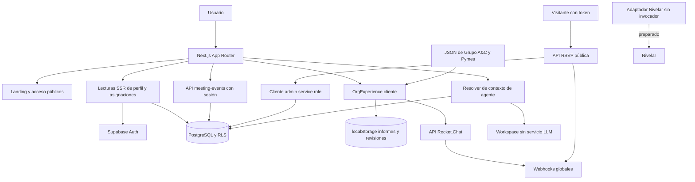
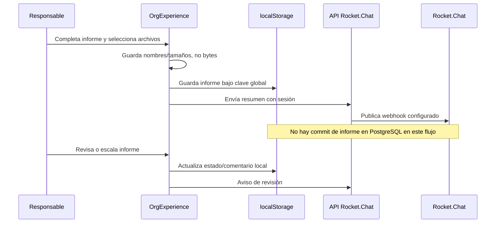
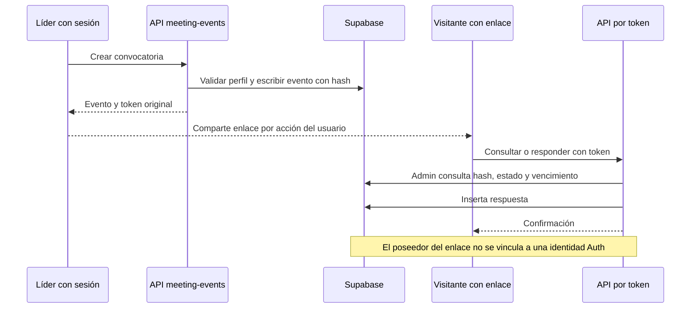

# Arquitectura AS-IS

El sistema es una aplicación Next.js App Router con componentes React cliente, lecturas SSR y Route Handlers. Su backend combina acceso directo a Supabase bajo sesión, APIs de servidor y un punto privilegiado con service role. No es todavía un sistema de registro único para toda la gestión. Alcance y taxonomía: [00](00-executive-summary.md).

## Frontend y composición

[layout](../../src/app/layout.tsx) y [globals.css](../../src/app/globals.css) sostienen la experiencia visual. [OrgExperience](../../src/components/OrgExperience.tsx) concentra mapa, búsqueda, navegación por cargo, restricciones visuales, dashboard, informe semanal, revisión, indicadores, integración de alertas e impresión. Su catálogo se importa desde JSON en un componente `use client` (líneas 1, 30, 607). Esto acopla contenido de una organización al bundle.

[MapaVivoPage](../../src/app/mapa-vivo/page.tsx) obtiene sesión, perfil y asignaciones; convierte `position_id` UUID a `external_key` para localizar nodos del JSON. [MapaVivoAuthGate](../../src/components/MapaVivoAuthGate.tsx) repite parte de esa resolución en cliente cuando falta el perfil/asignaciones. El filtrado del mapa y `canViewSensitiveData` operan después de recibir los datos: no son controles de confidencialidad del catálogo.

Las fichas combinan catálogo organizacional, perfiles funcionales y cartera de clientes atendidos. Estos clientes son entidades de negocio del área Pymes, **no tenants del SaaS**. [functional-profile](../../src/lib/conecta/functional-profile.ts) depende de claves fijas; [company-portfolio](../../src/lib/conecta/company-portfolio.ts) depende de un mapa JSON por cargo.

## Backend y límites

- [browser](../../src/lib/supabase/browser.ts): Supabase con llave pública y sesión; permite Data API directa. La RLS debe proteger incluso cuando se evita toda interfaz.
- [server](../../src/lib/supabase/server.ts): cliente SSR con cookies. [middleware](../../middleware.ts) llama `getUser()` y gestiona cookies; no redirige ni aplica autorización general.
- [admin](../../src/lib/supabase/admin.ts): llave privilegiada; únicamente se encontró utilizado por RSVP público. Allí la protección depende del endpoint y el token, no de RLS del visitante.
- [API de agente](../../src/app/api/agent/context/route.ts): misma resolución que la página, sin aceptar permisos del cliente. Empresa activa, cargo filtrado por empresa, proyección funcional y cache privada deshabilitada.
- [APIs de convocatorias](../../src/app/api/meeting-events/route.ts): creación/listado con perfil activo y roles de liderazgo. Verificación de Bearer y consultas con cliente de cookies no comparten necesariamente el mismo JWT cuando el consumidor no usa cookies; comprobar el contrato, no asumir soporte completo de cliente externo.

No se encontraron repositorios de dominio separados, trabajos en segundo plano, cola durable, Server Actions, Edge Functions, Realtime consumido, búsqueda semántica ni runtime de agente.

## Flujo real de gestión

Evidencia: OrgExperience líneas 1182–1288 y 1383–1388. [reports.ts](../../src/lib/conecta/reports.ts) y [notifications.ts](../../src/lib/conecta/notifications.ts) contienen wrappers de persistencia sin consumidores encontrados. Por ello una notificación enviada no acredita la existencia de un informe compartido ni su trazabilidad.

## Modelo y dependencias

[Modelo de datos y RLS](04-data-and-permissions.md) detalla empresas, cargos, perfiles, frentes, asignaciones, informes, evidencias, revisiones, notificaciones y reuniones. Áreas y unidades son texto en cargos; objetivos/KPI y procesos son arrays o contenido JSON, no entidades con mediciones y ciclos de vida. Las personas se mezclan con cargos y perfiles.

| Dependencia | Consecuencia actual |
| --- | --- |
| Auth → perfil → `external_key` → nodo JSON | Cargo creado en BD puede no tener ficha completa visible |
| UI informes → estado local → dashboard/revisiones | No existe consistencia entre navegadores ni control servidor del ciclo |
| UI informes → webhook global | Aviso puede sobrevivir a pérdida del informe local |
| Convocatoria → perfil/empresa → evento → respuestas | Backend más completo, pero sin acta, compromiso o decisión estructurada |
| Agente → perfil → empresa activa → cargo BD | No usa catálogo como fallback; puede mostrar contexto incompleto legítimamente |
| Nivelar → variables y tipos/SQL | Preparación sin job, escritura de resúmenes ni lectura real en UI |

## Despliegue y operación

[package.json](../../package.json) permite `next build`/`next start`; [next.config](../../next.config.ts) no agrega configuración. Vercel es el destino conocido por el contexto, pero no se inspeccionó configuración remota ni correspondencia entre HEAD y release. Tampoco se certificó región, backups, límites de funciones, WAF, autenticación MFA o protección de previews.

La [auditoría histórica](../audits/agent-context-supabase-20260916.md) informa SQL aplicado sin historial de migraciones, 11 tablas y Storage no versionado localmente. El schema local incluye 14 tablas. Esa diferencia exige reconciliación; no se debe aplicar indiscriminadamente `schema.sql` más todas las migraciones.

## Fronteras de confianza

1. Navegador no confiable: roles visuales, `company_id`, actor y destinos no pueden autorizar operaciones por sí solos.
2. Sesión Auth identifica cuenta; perfil y empresa activa deberían limitar negocio de forma uniforme. Actualmente solo el resolver del agente verifica expresamente empresa activa.
3. RLS es frontera para acceso con sesión; las políticas actuales permiten más que los botones de UI.
4. Service role cruza la frontera de RLS: el endpoint RSVP debe garantizar capacidad mínima, vigencia, antiabuso y datos públicos limitados.
5. Rocket.Chat y Nivelar son terceros: requieren minimización, configuración por tenant, redacción de logs y trazabilidad.
6. Catálogos cliente y activos públicos quedan fuera del aislamiento de PostgreSQL.

La recomendación de verificar autorización cerca del acceso a datos concuerda con la [guía oficial de Next.js](https://nextjs.org/docs/app/guides/authentication); aquí se aplica a los límites observados, sin atribuir al framework una protección que el repositorio no implementa.
