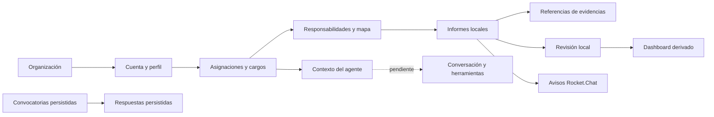

# Mapa funcional de Conecta

Estado según código del 18/09/2026; «implementado» no acredita despliegue ni prueba integral. [Convenciones](00-executive-summary.md).

## Cadena funcional

Las flechas describen dependencias funcionales; no implican que todas estén persistidas en PostgreSQL.

## Matriz de módulos

| Módulo / problema | Usuarios | Entradas → proceso → salidas | Permisos efectivos | Tablas / APIs / dependencias | Estado real y evidencia |
| --- | --- | --- | --- | --- | --- |
| Acceso: identificar quién opera | Personal con cuenta, administradores de alta | Correo/clave o recuperación → Supabase Auth → sesión | Auth valida cuenta; perfil activo requerido para mapa; no alta autoservicio en UI | Auth, `user_profiles`; cliente Supabase | **Implementado** en [ConectaAccess](../../src/components/ConectaAccess.tsx), [auth](../../src/lib/conecta/auth.ts); invitaciones operadas fuera de módulo SaaS |
| Empresa: delimitar organización | Administración | Empresa y estado → helpers perfil/empresa → alcance BD | `current_company_id`; empresa activa solo comprobada expresamente en agente | `companies`, `user_profiles`; no CRUD tenant | **Parcial**, [schema:38,209](../../supabase/schema.sql); no membresía multiorganización |
| Mapa Vivo: ubicar responsabilidad y jerarquía | Dirección, gerencia, responsables, lectores | JSON + cargo/asignaciones BD → filtros y selección → organigrama/ficha/impresión | Gate Auth; restricciones visuales, JSON completo en cliente | `positions`, `user_position_assignments`, `operational_fronts` para identidad; sin API de catálogo | **Parcial**, [OrgExperience:30,607](../../src/components/OrgExperience.tsx), [page](../../src/app/mapa-vivo/page.tsx) |
| Personas, cargos y áreas: describir funciones | Personal, cultura, dirección | Datos estáticos → ficha → propósito, funciones, autoridad | UI puede ocultar campos sensibles; no retiro de datos del bundle | JSON, campos de `positions`; áreas como texto | **Parcial**, [ExecutiveRoleProfile](../../src/components/ExecutiveRoleProfile.tsx), [functional-profile](../../src/lib/conecta/functional-profile.ts); no persona independiente ni editor |
| Frentes y múltiples cargos: representar trabajo transversal | Responsables y líderes | Asignaciones activas → resolución cargo/frente → opciones de informe | Consulta por perfil y RLS; lectura no filtra vigencia por fechas | `user_position_assignments`, `positions`, `operational_fronts` | **Parcial**, [page:30](../../src/app/mapa-vivo/page.tsx), [gate:58](../../src/components/MapaVivoAuthGate.tsx); selector contextual agente usa solo cargo principal |
| Cartera Pymes: visibilizar clientes a cargo | Equipo Pymes y gerencia | JSON por cargo → sumas de días → cartera visible | Asociación visual por clave; sin RLS del catálogo | `pymes-company-assignments.json`; no tabla de clientes atendidos | **Simulado/estático** en [AssignedCompanies](../../src/components/AssignedCompanies.tsx), [company-portfolio](../../src/lib/conecta/company-portfolio.ts); datos de catálogo pueden ser reales, persistencia SaaS no |
| Informes: reportar avances, riesgos y decisiones | Responsables, gerencia | Formulario → objeto local → informe y aviso | Botones según matriz UI; SQL INSERT solo controla company | `management_reports` preparada; wrappers sin uso; POST Rocket.Chat | **Simulado en flujo UI / backend parcial**, [OrgExperience:1230](../../src/components/OrgExperience.tsx), [reports](../../src/lib/conecta/reports.ts) |
| Evidencias: sustentar informe | Autores y revisores | Selección de archivos/enlaces → conserva nombre/tamaño/URL → referencia local | Sin autorización ni subida de bytes por UI; RLS de metadatos por informe | `report_evidence` preparada; Storage solo documentado históricamente | **Parcial**, [OrgExperience:1182,2693](../../src/components/OrgExperience.tsx); no gestión documental operativa |
| Revisión: aprobar, observar o escalar | Dirección, gerencia, cultura | Informe local/comentario → cambio estado local → etiqueta y webhook | UI según rol; SQL de revisiones no valida empresa del informe | `report_reviews` preparada; sin llamada de persistencia desde UI | **Simulado en UI**, [OrgExperience:1189](../../src/components/OrgExperience.tsx); no transacción informe/revisión |
| Dashboard e indicadores: orientar seguimiento | Dirección/gerencia/cultura según matriz UI | Catálogo y reportes locales → filtros/conteos → señales | Permiso visual de dashboard; SQL de reportes no limita equipo | Sin tabla de mediciones; `kpis` es array en cargo | **Parcial/simulado**, [OrgExperience](../../src/components/OrgExperience.tsx); no serie histórica ni metodología versionada |
| Alertas y notificaciones: avisar gestión | Personal autorizado de negocio, actualmente cualquier sesión válida en API Rocket.Chat | Payload cliente → webhook → aviso externo | Auth de API insuficiente para tenant/recurso; excepción local | `notifications` wrapper sin uso; `/api/rocket-chat` | **Parcial**, [API](../../src/app/api/rocket-chat/route.ts), [adaptador](../../src/lib/conecta/rocket-chat.ts); sin outbox ni reintento durable |
| Convocatorias: programar y confirmar asistencia | Líderes; invitados por enlace | Logística → evento/token → invitación; respuesta → fila → conteos | Crear/listar API: superadmin/direccion/gerencia/cultura; token público responde | `meeting_events`, `meeting_responses`; APIs internas y por token | **Implementado en código**, [MeetingRsvp](../../src/components/MeetingRsvp.tsx), [SQL](../../supabase/20260826_meeting_events.sql); pruebas de abuso y ciclo cierre pendientes |
| Reuniones, actas y compromisos | Coordinadores y responsables | Temas y próximos pasos → hoy texto libre → sin workflow autónomo | No contrato propio de autorización | Temas en evento; acciones/decisiones en informe; sin tablas propias | **Proyectado** como dominio completo; [schema](../../supabase/schema.sql), [meetings SQL](../../supabase/20260826_meeting_events.sql) |
| Nivelar: contextualizar actividad laboral | Alcance Pymes planteado; líderes y titular | Adaptador preparado → ninguna sincronización invocada → UI estática y estado config | RLS SQL planeada: líderes o titular para resúmenes; status público | Tres tablas `nivelar_*`; `/api/nivelar/status`; env global | **Parcial/proyectado**, [nivelar](../../src/lib/conecta/nivelar.ts); ausencia remota documentada históricamente |
| Mi agente: asistencia contextual del cargo | Usuario activo con empresa activa | Sesión → perfil/empresa/cargo → contexto funcional mínimo | Resolver servidor, RLS y company; `permissions: []` | `/api/agent/context`; `user_profiles`, `companies`, `positions` | **Contexto implementado**, [resolver](../../src/lib/conecta/agent/context.ts); **conversación proyectada**, [AgentWorkspace](../../src/components/agent/AgentWorkspace.tsx) no inyecta servicio |
| Configuración, billing, auditoría y operación SaaS | Administrador tenant y plataforma | Contrato/plan/configuración → no flujo actual → pendientes | Sin separación de administrador tenant/plataforma | Sin tablas/rutas específicas en inventario | **Proyectado**, contraste con [inventario](01-system-inventory.md); `nivelar_sync_runs` no sustituye auditoría general |

## Inconsistencias de contrato a resolver

- UI utiliza revisiones con estado `ajuste`; SQL enum usa `ajuste_solicitado`. El modelo local incluye campos de cartera y gestión específicos no representados de igual modo en `management_reports`. Evidencia: [OrgExperience:1189–1267](../../src/components/OrgExperience.tsx), [schema:12–21,116–137](../../supabase/schema.sql).
- Los permisos de [access-policy.ts](../../src/lib/conecta/access-policy.ts) no coinciden completamente con `accessProfiles` de OrgExperience; por ejemplo, cultura tiene capacidad visual de crear/ver sensibles, pero la tabla declarativa no expresa esas capacidades. Ninguna reemplaza RLS.
- La cartera de empresas atendidas no debe convertirse automáticamente en tenants. Requiere entidad `client_accounts` dependiente del tenant, con relación propia a personas/cargos/asignaciones.
- Objetivos, indicadores, compromisos y decisiones visibles como textos o métricas derivadas no constituyen dominios persistidos con responsable, vigencia y eventos auditables.
