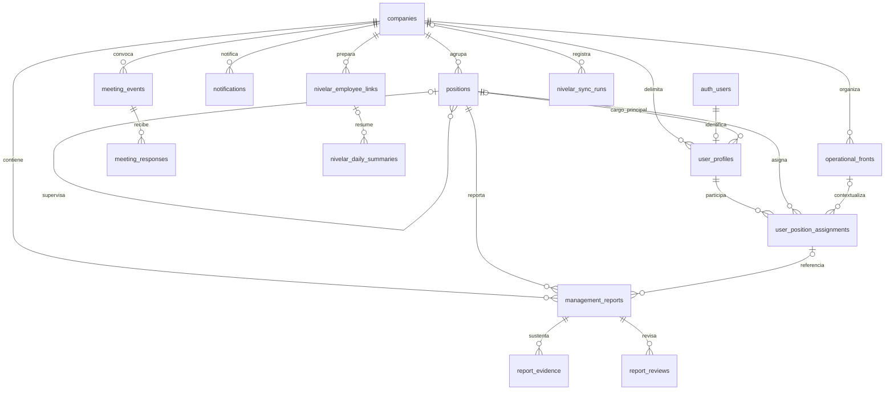

# Modelo de datos y permisos AS-IS

Fuente primaria: [schema.sql](../../supabase/schema.sql), cuatro migraciones y SQL de meetings. [Inventario](01-system-inventory.md) identifica los archivos. Se distingue SQL local de configuración remota histórica; no se ejecutaron consultas SQL en esta auditoría.

## Modelo local

Diagrama simplificado: `auth_users` representa `auth.users`. Las relaciones dibujadas son FK, no pruebas de pertenencia coherente a un tenant.

| Tabla | Función / frontera | Controles y deuda |
| --- | --- | --- |
| `companies` | Organización base, nombre/slug/estado | Slug único; estado no incorporado en helpers SQL |
| `positions` | Cargo, jerarquía, área/unidad textuales, contenido funcional y datos del ocupante | Unique `(company_id, external_key)`; padre solo por UUID; mezcla persona/cargo y contenido |
| `user_profiles` | Perfil de cuenta, empresa, rol y cargo principal | `auth_user_id` único global: una cuenta no admite dos perfiles/empresas; documento y teléfono junto a datos generales |
| `operational_fronts` | Frente operativo y cargo receptor | Unique empresa/clave; receptor sin FK compuesta de tenant |
| `user_position_assignments` | Cargo/frente por perfil, tipo, principalidad y fechas | Unique con columna nullable; sin check orden de fechas ni único principal; referencias independientes |
| `management_reports` | Informe por cargo/frente/asignación; autor/receptor; estado/periodo/riesgos | Falta vínculo autenticado autor-asignación; referencias independientes; UI aún no lo usa |
| `report_evidence` | Nombre/URL/tipo y cargador | Hereda tenant por informe; no vínculo fuerte al objeto Storage |
| `report_reviews` | Decisión, comentario y revisor | Hereda tenant por informe; INSERT no lo comprueba |
| `notifications` | Destinatario, cargo/informe, canal/estado | Empresa propia en INSERT, pero destinatario/referencias no vinculados; sin UPDATE para lectura en SQL base |
| `meeting_events` | Logística, creador, token hash, estado y expiración | Empresa; checks de costos/quorum; expiración nullable en esquema, API la fija a 30 días |
| `meeting_responses` | Identidad declarada, respuesta y requerimientos | Empresa derivada del evento; sin invitado único, duplicados posibles |
| `nivelar_employee_links` | Correspondencia con empleado externo | Company y documento únicos; lectura de identificadores por toda empresa |
| `nivelar_daily_summaries` | Métricas laborales por persona/día | Unique empresa/documento/día; datos sensibles y `raw_payload`; RLS de lectura más limitada |
| `nivelar_sync_runs` | Estado de una ejecución de integración | Company nullable; no sustituye log general; no se encontró worker que escriba |

Evidencia: schema líneas 38–171; [meetings](../../supabase/20260826_meeting_events.sql) líneas 5–44; [Nivelar](../../supabase/migrations/20260902_nivelar_integration.sql) líneas 1–64.

No se definen entidades independientes de personas, departamentos, objetivos, mediciones, compromisos, decisiones, invitaciones, membresías, suscripciones, documentos versionados ni conversaciones. Los conceptos parciales actuales están en strings, arrays, JSON o estado del navegador.

## Autenticación y roles

Supabase Auth valida la cuenta. `current_profile`, `current_company_id` y `current_access_role` resuelven por `auth.uid()` y perfil activo (`schema:195–235`). Son `STABLE SECURITY DEFINER`, `search_path=public`; no comprueban estado de empresa. No admiten elegir un tenant entre membresías. No se encontró uso de metadata editable para conceder permisos.

| Rol | Intención en `access-policy.ts` | Diferencia con backend |
| --- | --- | --- |
| `superadmin` | Ver todo, crear/revisar/aprobar, usuarios, sensibles, catálogo | Helpers lo atan a una empresa; no operador global SaaS implementado |
| `direccion` | Ver todo, revisar/aprobar, sensibles | SQL permite insertar informes por empresa aunque UI no lo ofrezca |
| `gerencia` | Equipo, crear/revisar/aprobar | RLS de informes lee toda empresa, no equipo/subárbol |
| `responsable` | Cargo propio, crear informe | RLS base lee empresa completa y no exige autor/asignación al crear |
| `cultura_conecta` | Ver todo, revisar, catálogo | SQL permite actualizar informes y API meetings crear; divergencia con catálogo declarativo |
| `lector` | Solo cargo propio | INSERT de informes/evidencias/notificaciones no excluye este rol |

Fuente: [access-policy:14](../../src/lib/conecta/access-policy.ts), [OrgExperience:314–395](../../src/components/OrgExperience.tsx), schema políticas. La matriz de producto debe definirse una sola vez y probarse en los puntos de acceso reales.

## Políticas locales, por operación

`empresa` significa igualdad con `current_company_id()`. `revisores`: superadmin, direccion, gerencia, cultura_conecta. «Sin política» significa denegado para sesión ordinaria con RLS, salvo otra política aplicada fuera de estos archivos o un rol que la evada.

| Recurso | SELECT | INSERT | UPDATE / DELETE |
| --- | --- | --- | --- |
| companies | Empresa propia | Sin política | Sin política |
| positions | Empresa; migración agrega empresa OR cargo asignado | Sin política | Sin política |
| user_profiles | Toda empresa OR perfil propio activo | Sin política | Self-update eliminado; sin política restante local |
| operational_fronts | Empresa; migración agrega empresa OR frente asignado | Sin política | Sin política |
| assignments | Empresa OR asignación propia por perfil | ALL de catálogo: empresa + superadmin/direccion/cultura | Igual política ALL; no integridad de refs por tenant |
| management_reports | Empresa | Empresa; sin rol/autor/asignación | UPDATE empresa+revisores, CHECK empresa; DELETE sin política |
| report_evidence | Informe en empresa | Informe en empresa; cargador no atado a sesión | Sin política |
| report_reviews | Informe en empresa | Solo rol revisor; falta pertenencia del informe y autoría | Sin política |
| notifications | Empresa y destinatario propio o superadmin/direccion | Empresa; no valida rol ni destinatario | Sin política |
| meeting_events | Empresa, authenticated | Empresa+revisores | UPDATE empresa+revisores; DELETE sin política |
| meeting_responses | Evento en empresa | ALL de revisores sobre evento en empresa; público solo vía admin API | Misma política ALL |
| nivelar_employee_links | Empresa | ALL liderazgo: superadmin/direccion/cultura + empresa | Igual ALL |
| nivelar_daily_summaries | Empresa y liderazgo o perfil titular | Sin política | Sin política |
| nivelar_sync_runs | Empresa y liderazgo | Sin política | Sin política |

Referencias: [schema:237–338](../../supabase/schema.sql), [lecturas de asignaciones](../../supabase/migrations/20260813_responsible_assignment_read_policies.sql), [restricción perfil](../../supabase/migrations/20260909_restrict_profile_self_update.sql), [meetings:54–121](../../supabase/20260826_meeting_events.sql), [Nivelar:77–111](../../supabase/migrations/20260902_nivelar_integration.sql).

Las políticas permisivas se combinan con OR: añadir una de «cargo propio» no restringe la de «toda empresa». RLS limita filas, no elimina automáticamente columnas sensibles. Grants y RLS deben revisarse juntos; [documentación oficial](https://supabase.com/docs/guides/database/postgres/row-level-security).

## Local frente a evidencia histórica remota

El [registro del 16/09](../audits/agent-context-supabase-20260916.md), líneas 13–33 y 80–135, informa:

- 11 tablas con RLS y 21 políticas permisivas; no tablas Nivelar ni historial `schema_migrations`.
- No políticas locales `read assignments by company`, `manage assignments by catalog roles` ni `read operational fronts by company` en aquella base. Por eso no debe atribuirse a producción toda la matriz local.
- Perfiles sin política UPDATE/ALL, cerrando la edición propia de rol/empresa documentada en septiembre.
- Helpers ejecutables por anon/authenticated; filtran UID, por lo que no se concluye fuga anónima solo por `SECURITY DEFINER`.
- Bucket privado y vacío con cuatro políticas que solo filtran bucket; no tenant, informe ni propietario.
- Cero triggers públicos de usuario; FK no compuestas; columnas `updated_at` sin trigger automático documentado.

Esta auditoría no revalidó esos hechos remotamente. La comparación actual requiere metadatos y pruebas con JWTs ordinarios, no inferencias desde una sesión `postgres`.

## Reglas de integridad pendientes

Todas las referencias de un recurso deben pertenecer a su tenant; además, actor, cargo y asignación deben estar autorizados. Un UUID existente no satisface ninguna de esas dos condiciones. Deben definirse vigencia de asignaciones, unicidad del cargo principal, prevención de ciclos jerárquicos, transición de estados e idempotencia. El plan es propuesto en [TO-BE](07-to-be-architecture.md); aquí no se ejecuta DDL.
