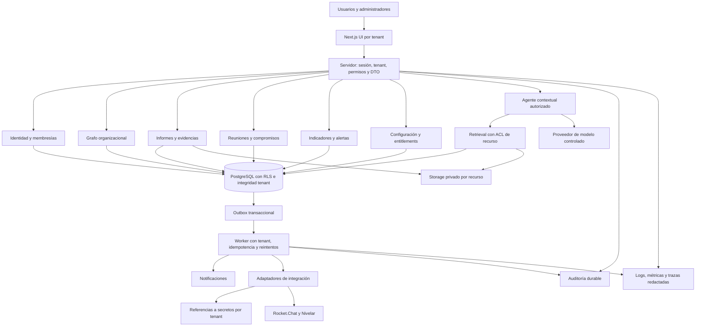
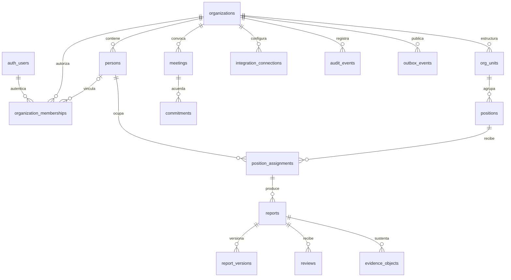
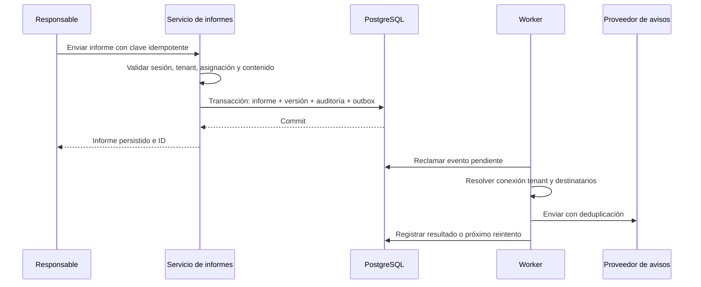

# Arquitectura TO-BE — SaaS modular

**Propuesta, no implementación.** Conservar Next.js, React, TypeScript y Supabase/PostgreSQL y evolucionar por módulos dentro de un despliegue principal. Separar trabajos durables cuando la operación los necesite. No introducir microservicios, un motor de grafos externo o infraestructura de IA sin evidencia de necesidad.

## Vista objetivo

Las fronteras son lógicas; pueden comenzar como directorios y servicios internos. Las lecturas directas Data API que se conserven deben satisfacer las mismas reglas. Los comandos que cambian varios recursos, autorizan transiciones o generan efectos externos pasan por servicios transaccionales.

## Módulos, propietarios de datos y contratos

| Módulo | Responsabilidad y datos propuestos | Contratos / límites |
| --- | --- | --- |
| Tenant management | `organizations`, estado, ciclo contractual, dominios | Crear/suspender/exportar/cerrar tenant; operaciones plataforma separadas del administrador cliente |
| Identity and access | Auth global; `persons`, `organization_memberships`, `invitations`, roles/scopes | Cuenta ≠ persona ≠ cargo. Tenant activo resuelto por membresía; role/tenant del body nunca otorgan permiso |
| Organizational graph | `positions`, `org_units`, `position_relations`, `position_assignments`, `operational_fronts`; fichas versionadas | Propósito y funciones publicados; jerarquía sin ciclos; múltiples cargos vigentes; historial de ocupación |
| Reports and evidence | Informes/versiones/periodos, revisiones, metadatos de documentos/objetos | Crear/enviar/revisar dentro de una transacción; actor servidor; estados y permisos explícitos; evidencias autorizadas |
| Meetings and commitments | Eventos, invitados, respuestas, actas, compromisos, decisiones | RSVP separado de identidad verificada; compromisos con responsable, plazo, estado y vínculo a informe/acta |
| Indicators and alerts | Definiciones/versiones, mediciones, umbrales, alertas | Definición y procedencia visibles; deduplicación; métricas no inventadas desde textos |
| Integrations | Conexiones por tenant/proveedor, mapeos externos y ejecuciones | Contrato de lectura/sync; credencial referenciada; scopes y límites; idempotencia y aislamiento en workers |
| Audit log | Eventos inmutables de negocio y autorización | Append-only, actor/tenant/recurso/acción/resultado/request ID; acceso restringido y retención definida |
| Notification layer | Preferencias, plantillas, outbox, intentos y entregas | Distinguir commit de negocio de entrega; destinatarios resueltos servidor; reintento con backoff y cola de fallos |
| Configuration | Branding, zona horaria, idioma, periodos, taxonomías, flags | Defaults de plataforma + override tenant validado/versionado; sin secretos en configuración pública |
| Billing readiness | Planes, suscripciones contractuales, entitlements, consumo y cuotas | Permiso de usuario independiente de capacidad contratada; cobro manual posible en piloto; proveedor de pagos futuro |
| Contextual agent | Sesiones, consultas, ejecuciones, fuentes citadas y costes | Contexto autorizado por petición; lectura primero; RAG/herramientas solo tras gates de privacidad y autorización |
| Observability | SLI, logs/trazas/métricas y alertas | Tenant/request ID opacos, sin PII/token/payload laboral en logs; auditoría de negocio separada de diagnóstico |

Estos nombres de tablas son propuestas conceptuales, no archivos ni recursos existentes. Contraste AS-IS: [inventario](01-system-inventory.md) y [mapa funcional](03-functional-map.md).

## Modelo central propuesto

Decidir si `companies` conserva el nombre o se migra a `organizations`; evitar dos fuentes de tenant. Las compañías legales/clientes atendidos pueden ser entidades subordinadas. Las FK compuestas `(organization_id, recurso_id)` deben impedir vínculos cruzados aun bajo errores de aplicación. Persona y membresía se enlazan con unicidad según el negocio; no toda persona necesita usuario.

## Invariantes de autorización

1. Identidad proviene de sesión validada; membresía activa en tenant activo se resuelve en servidor.
2. Tenant seleccionado es una preferencia no confiable hasta comprobar membresía; IDs de ruta/body se autorizan por recurso.
3. Toda tabla empresarial tiene tenant obligatorio o padre inequívoco, y restricciones de coherencia. RLS y grants se prueban por operación.
4. Permiso efectivo = membresía + rol/scopes + relación con recurso + estado/vigencia + capacidad contratada. Un entitlement habilita módulo; no concede acceso a registros.
5. Campos laborales sensibles se separan de la ficha funcional general. DTO mínimo, Storage autorizado y búsqueda filtrada antes de recuperar contenido.
6. Servicio privilegiado limitado a operaciones justificadas; no usar service role genérica como sustituto de permisos de usuario. Un worker verifica tenant, recurso y estado en cada reintento.
7. Acceso de soporte de plataforma separado del rol del cliente, temporal, motivado y auditado. Evitar `superadmin` ambiguo.

RLS/grants y Storage constituyen controles distintos y complementarios según [Supabase RLS](https://supabase.com/docs/guides/database/postgres/row-level-security) y [Storage](https://supabase.com/docs/guides/storage/security/access-control).

## Persistencia y eventos

Una falla de mensajería no elimina el informe ni se oculta sin registro. Los eventos contienen IDs y datos mínimos; destinatarios y contenido se resuelven bajo políticas vigentes. Definir claves idempotentes por tenant/operación, estados de outbox, límites de reintentos y tratamiento de entrega incierta.

## Documentos y datos sensibles

Objetos privados con ruta lógica tenant/recurso/ID, pero la ruta no es autorización. Tabla de metadatos ligada al informe; URLs firmadas de vida limitada entregadas solo tras permiso; validación de tamaño/tipo y cuarentena/escaneo según archivos admitidos. Versionado y hash de contenido para trazabilidad. Exportación y eliminación cubren metadatos, objetos y referencias externas; backups siguen su política de retención explícita.

No copiar métricas laborales completas al agente ni a chats por defecto. Configurar finalidad, roles habilitados y periodo de conservación antes de Nivelar. Minimizar `raw_payload`; si se conserva para diagnóstico, restringir y expirar. Las exigencias jurídicas se validarán por responsables contractuales; este documento no emite un dictamen legal.

## Agente contextual

Conservar el resolver actual como punto inicial, ampliándolo solo tras reconciliar cargo publicado y membresías. El servidor deriva tenant/cargo/contexto; consulta del usuario no puede ampliar ACL. Etapas: contexto de lectura → conversación sin acciones → retrieval con permisos por documento/chunk → herramientas autorizadas por acción y recurso. Documentos y mensajes son datos no confiables, nunca autoridad para herramientas. Acciones con efecto externo requieren confirmación definida por producto, idempotencia, evidencia de autorización y auditoría. Registrar versión del modelo/prompt, fuentes y coste sin retener datos sensibles innecesarios. Denegar herramientas mientras no existan contratos y pruebas; no presentar tarjetas de capacidades como ejecución real.

## Entornos, observabilidad y continuidad

Separar development, demo sintética, staging y producción, con proyectos/credenciales/destinos de prueba independientes. Versionar esquema, RLS, Storage y configuración no secreta; reconciliar producción antes de crear baseline. CI: tipos, lint, unitarias, integración/RLS, E2E, secret scan y revisión de dependencias. Migraciones futuras con estrategia expandir–migrar–contraer, respaldo y reversión verificable; ningún cambio se aplica en esta auditoría.

Medir éxito/latencia de comandos, denegaciones anómalas, persistencia, retraso/fallos de outbox, errores de integraciones, uso/cuotas y costes de agente. Definir SLO y RPO/RTO con el piloto sin inventar valores. Ejercitar restauración DB+archivos y reconciliación de efectos externos; no solo confiar en un indicador de backup.

## Decisiones de arquitectura propuestas

| Decisión | Razón / tradeoff |
| --- | --- |
| Monolito modular inicialmente | Menor complejidad operativa; fronteras y contratos permiten extraer workers si volumen lo exige |
| Tenant explícito en todos los dominios | Aislamiento y administración verificables; requiere migración de membresías y referencias |
| PostgreSQL como fuente de verdad | Evita divergencia JSON/localStorage; catálogo publicado requiere editor/importación controlada |
| RLS + servicio de autorización + integridad | Cada capa cubre fallos distintos; pruebas deben evitar reglas contradictorias |
| Outbox antes de ampliar canales | Coherencia entre gestión y avisos; operación adicional de worker/cola de fallos |
| Agente sin privilegios especiales | Reutiliza autorización del usuario; lectura y herramientas evolucionan de forma controlada |

La siguiente implementación debe ser un cambio acotado y autorizado contra este plano, no una reconstrucción de una sola vez.
